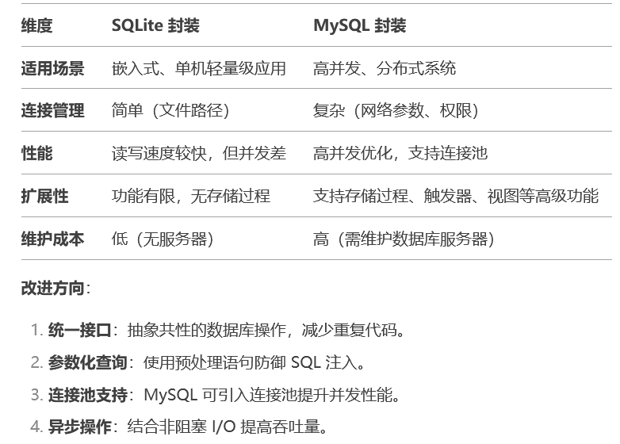

# 易播Linux服务器端文档
## 首先应该介绍进程关系如下:
一共有三个进程：主进程、日志服务器进程、客户端处理进程。

## EPlayerServer.h
这段代码是一个基于epoll和线程池的HTTP服务器，处理客户端连接和登录验证。但存在一些潜在的安全问题和代码健壮性问题，需要进一步优化和改进。

首先，用户提供了一个头文件EPlayerServer.h的代码，属于一个名为CEdoyunPlayerServer的类，继承自CBusiness。看起来这是一个服务器端的业务处理类，处理客户端的连接和HTTP请求，特别是登录验证部分。我需要详细解释这段代码的各个部分。

首先，我注意到代码开始处有一些宏定义，比如DECLARE_TABLE_CLASS和DECLARE_MYSQL_FIELD，这些应该用于定义数据库表结构。接着是ERR_RETURN和WARN_CONTINUE宏，用于错误处理。然后，CEdoyunPlayerServer类的构造函数和析构函数中初始化了一些成员变量，如epoll、线程池、数据库连接等。

在BusinessProcess方法中，首先创建了数据库连接，连接到MySQL数据库。然后设置连接回调和接收回调函数，使用std::placeholders绑定到当前对象的成员函数。接着创建epoll实例和线程池，并添加任务到线程池。之后进入循环，接收客户端socket连接，将新的客户端socket添加到epoll中，并触发连接回调。

接下来是Connected和Received回调函数。Connected函数处理新客户端连接，打印客户端地址信息。Received函数处理接收到的数据，调用HttpParser解析HTTP请求，根据解析结果生成响应返回给客户端。

HttpParser方法解析HTTP请求，判断是GET还是POST方法。如果是GET请求，解析URL参数，处理登录逻辑。查询数据库验证用户信息，计算MD5签名进行验证。验证成功返回0，否则返回错误码。

MakeResponse方法根据验证结果生成JSON格式的HTTP响应，设置HTTP头信息，如状态码、日期、内容类型等，并将JSON数据作为响应体返回。

ThreadFunc是线程函数，使用epoll监听事件，处理可读事件，接收客户端数据，并调用接收回调处理数据。

现在我需要详细解释每个部分的功能，并指出可能的问题或优化点。例如，在析构函数中，是否有资源释放的问题？在数据库查询时是否有SQL注入的风险？在MD5计算时使用的密钥是否安全？HTTP响应头是否正确？

另外，注意到代码中有一些可能的错误，比如在接收socket时，使用proc->RecvSocket，但proc的具体类型和实现未给出，可能导致理解困难。此外，在HTTP解析时，UrlParser的参数拼接是否正确？比如"https://192.168.31.76" + parser.Url()是否合理？

还有，线程池中的线程数是否合理？每个线程都在处理epoll事件，是否可能导致竞争条件？在m_mapClients中存储了客户端socket，但在析构时遍历删除，但在BusinessProcess中添加客户端到epoll时并没有将socket存入m_mapClients，这可能导致析构时无法正确释放所有socket资源。

在HttpParser中，处理登录时直接拼接SQL查询条件，可能导致SQL注入，例如用户输入中包含双引号或其他特殊字符。应该使用参数化查询或转义输入内容。

另外，在计算MD5时，将time、MD5_KEY、pwd、salt拼接后进行MD5，这种方式是否安全？密钥是否应该存储在更安全的地方，而不是硬编码在代码中？

此外，HTTP响应头中的Date字段生成是否正确？使用localtime函数返回的指针是否需要考虑线程安全问题？因为localtime返回的是静态内存，多线程环境下可能有问题，应使用localtime_r替代。

在MakeResponse中，生成JSON响应时，如果出现异常情况，是否有足够的错误处理？例如，数据库连接失败时的处理。

还有，代码中使用了TRACEI、TRACEE等宏，可能是日志记录，但具体实现未给出，是否会影响理解代码流程？

总结来说，这段代码是一个基于epoll和线程池的HTTP服务器，处理客户端连接和登录验证。但存在一些潜在的安全问题和代码健壮性问题，需要进一步优化和改进。

以下是代码的详细解释，按功能模块划分：

### 一、宏定义与数据库表结构

#### DECLARE_TABLE_CLASS 系列宏

    用于定义MySQL表结构edoyunLogin_user_mysql，包含用户ID、QQ、手机、姓名等字段。

    每个字段指定了类型、约束（如NOT_NULL）、默认值等信息。

    示例：user_id是自增主键，user_phone默认值为18888888888。

    ERR_RETURN 和 WARN_CONTINUE 宏

    错误处理宏：检查返回值，打印错误日志并返回或继续循环。

### 二、类结构与成员变量

#### 继承关系

    CEdoyunPlayerServer继承自CBusiness，实现业务处理逻辑。

#### 成员变量

    m_epoll: 用于管理I/O多路复用的Epoll实例。

    m_pool: 线程池处理并发任务。

    m_db: MySQL数据库客户端，执行查询操作。

    m_mapClients: 存储客户端Socket的映射（但代码中未正确使用）。

### 三、核心方法解析
1. 构造函数与析构函数

    构造函数：初始化线程数量。

    析构函数：释放数据库连接、关闭epoll/线程池、清理客户端Socket。

2. BusinessProcess 方法

    流程：

    创建MySQL连接，配置数据库参数。

    创建用户表（如果不存在）。

    设置连接和接收回调函数。

    初始化epoll和线程池。

    循环接收客户端连接，将Socket加入epoll监听。

3. 回调函数

    Connected()：客户端连接时打印地址信息。

    Received()：接收数据后解析HTTP请求，处理登录验证，返回响应。

4. HTTP请求处理

    HttpParser()：

        解析HTTP方法（GET/POST）。

        对GET请求处理登录：

            提取URL参数（time, salt, user, sign）。

            查询数据库验证用户存在性。

            计算MD5签名（time + 固定密钥 + 数据库密码 + salt），验证与客户端签名一致性。

5. 生成HTTP响应

    MakeResponse()：

        生成JSON格式响应体（成功/失败信息）。

        拼接完整HTTP响应头，包含日期、内容类型、长度等。

6. 线程函数

    ThreadFunc()：

        使用epoll监听事件，处理可读事件。

        接收数据并触发接收回调。

### 四、潜在问题与优化建议

#### SQL注入风险

    问题：直接拼接用户输入到查询条件（"user_name=\"" + user + "\""）。

    建议：使用参数化查询或转义用户输入。

#### 硬编码的安全密钥

    问题：MD5密钥*&^%$#@b.v+h-b*g/h@n!h#n$d^ssx,.kl<kl直接写在代码中。

    建议：从配置文件或环境变量读取密钥。

#### 日期生成的线程安全

    问题：localtime()返回静态指针，多线程可能冲突。

    建议：改用localtime_r()。

#### 资源管理

    问题：m_mapClients在析构时遍历删除，但添加Socket到epoll时未存入该映射。

    建议：确保所有客户端Socket正确存入映射，避免内存泄漏。

#### HTTP解析与URL拼接

    问题：UrlParser("https://192.168.31.76" + parser.Url())可能拼接错误。

    建议：检查URL处理逻辑，确保路径正确。

#### 日志与错误处理

    问题：部分错误仅打印日志，未关闭连接或回滚操作。

    建议：增强异常处理，确保资源释放。

### 五、总结

该代码实现了一个基于Epoll和线程池的HTTP服务器，处理用户登录验证。核心流程包括数据库操作、HTTP解析、签名验证。但需关注安全性（SQL注入、密钥管理）、资源管理（内存泄漏、线程安全）和代码健壮性（错误处理）。建议进行代码重构，引入现代C++特性（如智能指针）、使用安全库（如OpenSSL）、优化线程同步机制。   

## 函数基类Function.h
Function.h定义了一个用于包装和调用函数对象的模板类

定义了一个虚基类 CFunctionBase，该类包含几个虚拟函数运算符重载。
```
class CFunctionBase
{
public:
    virtual ~CFunctionBase() {}
    virtual int operator()() { return -1; }
    virtual int operator()(CSocketBase*) { return -1; }
    virtual int operator()(CSocketBase*, const Buffer&) { return -1; }
}
```
定义了一个模板类 CFunction，继承自 CFunctionBase。该模板类用于将函数对象和参数绑定在一起，并在调用时执行。
```
template<typename _FUNCTION_, typename... _ARGS_>
class CFunction : public CFunctionBase
{
public:
    CFunction(_FUNCTION_ func, _ARGS_... args)
        : m_binder(std::forward<_FUNCTION_>(func), std::forward<_ARGS_>(args)...)
    {}
    virtual ~CFunction() {}
    virtual int operator()() {
        return m_binder();
    }
    typename std::_Bindres_helper<int, _FUNCTION_, _ARGS_...>::type m_binder;
}
```
总结一下，这段代码通过模板类 CFunction 实现了一个函数对象包装器，可以在调用时执行绑定的函数对象和参数。它还提供了一个虚基类 CFunctionBase，使得可以通过多态机制调用不同的函数对象。如果你有更多问题或需要进一步的解释，请告诉我。

## 公共类Public.h
说白了就是扩展板的string字符串

Public.h里定义了Buffer类，通过继承string类并添加各种构造函数和类型转换运算符，扩展了 std::string 类的功能，使其更加灵活和易用。

## 进程Process.h
### 进程关系图如下:

### 进程创建顺序图如下：


这段代码定义了一个名为 CProcess 的类，该类用于管理子进程的创建、进程间通信以及文件描述符传递。

成员变量： m_func 和 pipes[2]管道数组,m_func是进程函数，管道用于进程的通信。

#### CreateSubProcess创建子进程
定义了一个 CreateSubProcess 函数，包装了fork函数。使用 socketpair 创建一个本地套接字对，用于进程间通信。使用 fork 创建子进程，并在子进程中执行 m_func 对象的函数。在主进程和子进程中分别关闭对应的管道端点（读和写）。

进程间的通信方式是用管道存储一对本地套接字描述符。用本地套接字来通信。

#### SendFD和Recv函数
通过本地套接字，可以在父进程和子进程之间传递文件描述符。父进程使用 SendFD 函数发送文件描述符。子进程使用 RecvFD 函数接收文件描述符：

#### 守护进程
守护进程通常会关闭标准输入输出（stdin、stdout、stderr），原因如下：
1.	避免占用终端：

    守护进程在后台运行，不需要与用户交互，因此不需要标准输入输出。
    
    关闭标准输入输出可以避免占用终端资源。

2.	防止意外输出：
	使用 umask 清除文件遮蔽位。
	umask 是一个进程级别的设置，用于控制新创建文件的默认权限。守护进程通常会将 umask 设置为 0，原因如下：
	1.	确保文件权限正确：

	    守护进程可能需要创建文件或目录，设置 umask 为 0 可以确保新创建的文件或目录具有预期的权限。

	    这可以避免由于默认 umask 设置导致的权限问题。
	2. 处理 SIGCHLD 信号:

	    SIGCHLD 信号是在子进程终止时发送给父进程的信号。守护进程通常需要处理 SIGCHLD 信号，原因如下：

        1. 避免僵尸进程：

	        当子进程终止时，如果父进程没有处理 SIGCHLD 信号，子进程会变成僵尸进程，占用系统资源。

	    2. 通过处理 SIGCHLD 信号，父进程可以调用 wait 或 waitpid 函数回收子进程的资源，避免僵尸进程的产生。

#### 守护进程流程图：

#### 存储消息的数据结构
msghdr、iovec 和 cmsghdr 是在网络编程中用于消息传递的结构体，主要用于高级的套接字操作，
特别是在使用 sendmsg 和 recvmsg 函数时。
msghdr 结构体用于描述一个消息，包括消息的地址、缓冲区和控制信息。它通常用于 sendmsg 和 recvmsg 函数。
```                       
struct msghdr {
	void* msg_name;       // 可选的地址
	socklen_t     msg_namelen;    // 地址长度
	struct iovec* msg_iov;        // 数据缓冲区数组
	int           msg_iovlen;     // 数据缓冲区数组的长度
	void* msg_control;    // 可选的附加数据（控制信息）
	socklen_t     msg_controllen; // 附加数据的长度
     	int           msg_flags;      // 消息标志
};
```
iovec 结构体用于描述一个缓冲区。它通常与 msghdr 结构体一起使用，用于指定消息的多个缓冲区。
```
struct iovec {
	void* iov_base; // 缓冲区的起始地址
	size_t iov_len;  // 缓冲区的长度
};
```
cmsghdr 结构体用于描述控制信息（如文件描述符传递、IP选项等）。它通常包含在 msghdr 结构体的 msg_control 字段中。
```
struct cmsghdr {
	socklen_t cmsg_len;   // 控制信息的长度
	int       cmsg_level; // 控制信息的协议级别
	int       cmsg_type;  // 控制信息的类型
	// 后面是控制信息的数据
};                
```    
# 日志模块设计
## 日志模块Logger.h
日志模块设计图如下：

日志模块顺序图如下：


分析Logger.h代码，
```
首先，用一个enum枚举定义了不同日志级别，如信息INFO、调试DEBUG、警告WARN, 错误ERROR等。这应该是用来分类日志信息的。接下来是LogInfo类，这个类负责封装日志信息，包括构造日志内容，并转换为Buffer类型以便传输。注意到LogInfo有多个构造函数，处理不同的日志输入方式，比如可变参数、流式操作符和内存数据。

然后，CLoggerServer类看起来是日志系统的核心，负责启动日志服务器，管理日志文件的创建，处理来自客户端的日志信息，并将日志写入文件。类中使用了Epoll和线程来处理并发连接，确保日志的高效写入。此外，Trace静态方法用于向日志服务器发送日志，而GetTimeStr生成时间戳用于日志文件名。

在宏定义部分，#define了TRACEI、TRACED等宏简化了日志调用，用户可以通过这些宏方便地记录不同级别的日志。流式日志的LOGI等宏允许使用<<操作符拼接日志信息，类似于C++标准库中的流操作。

接下来需要关注代码的各个部分，理解它们如何协同工作。例如，CLoggerServer的Start方法初始化日志服务器，创建epoll实例，启动线程处理事件。ThreadFunc作为线程函数，处理客户端的连接和日志数据的接收。WriteLog将接收到的日志数据写入文件，并确保及时刷新缓冲区。

同时，需要注意潜在的问题，比如线程安全性，因为多个客户端可能同时发送日志。检查代码中是否有适当的同步机制，比如是否使用互斥锁保护共享资源（如文件写入）。另外，内存管理方面，查看客户端套接字的创建和销毁是否正确，避免内存泄漏。

还有，LogInfo类的operator<<重载允许流式日志记录，这里使用了std::stringstream来拼接数据，可能会影响性能，需要评估是否适合高并发场景。此外，使用本地套接字进行进程间通信是否可靠，特别是在不同进程间传递日志时是否存在丢数据的风险。

最后，查看宏定义部分，确保TRACE和DUMP相关的宏正确展开，不会引入语法错误或作用域问题。例如，DUMPI宏用于记录内存数据，可能需要检查其实现是否正确处理二进制数据。

总结来说，我需要将代码分解为各个模块，逐一解释其功能、实现细节及潜在问题，确保用户能够全面理解Logger.h的设计和实现。

以下是 Logger.h 的详细解释，按功能模块划分：
```
### 一、核心类与结构
1. LogLevel 枚举

    定义日志级别：LOG_INFO（信息）、LOG_DEBUG（调试）、LOG_WARNING（警告）、LOG_ERROR（错误）、LOG_FATAL（致命错误）。

    用于分类日志的严重性。

2. LogInfo 类

    功能：封装单条日志的详细信息（文件、行号、函数名、进程/线程ID、日志级别、内容）。

    构造函数：

    1. 可变参数构造函数：支持 printf 风格的格式化输入（如 TRACEE("ret=%d", ret);）。

    2. 内存数据构造函数：直接写入二进制数据（如 DUMPI(pData, size);）。

    3. 流式日志构造函数：通过 operator<< 拼接日志内容（如 LOGI << "Hello" << 123;）。

    关键成员：

        m_buf：存储最终的日志内容（继承自 Buffer）。

        bAuto：标志位，用于区分流式日志（自动拼接）和其他日志。

    类型转换：

        operator Buffer()：将 LogInfo 转换为 Buffer，用于网络传输。

3. CLoggerServer 类

    功能：日志服务器，接收客户端日志并写入文件。

    核心成员：

        m_thread：后台线程，处理客户端连接和日志接收。

        m_epoll：用于监听套接字事件（Epoll 实现）。

        m_server：本地套接字（CLocalSocket），监听日志请求。

        m_file：日志文件指针。

    关键方法：

        Start()：初始化日志服务器（创建文件夹、打开文件、启动线程和 Epoll）。

        Close()：关闭资源（套接字、Epoll、线程）。

        ThreadFunc()：线程函数，处理客户端连接和日志接收。

        WriteLog()：将日志写入文件。

### 二、日志处理流程
1. 日志发送

    客户端：

        通过 TRACEI(...)、LOGI << ... 等宏生成 LogInfo 对象。

        调用 CLoggerServer::Trace() 发送日志到服务器。

    服务端：

        线程函数 ThreadFunc() 监听客户端连接。

        接收日志数据并调用 WriteLog() 写入文件。

2. Epoll 事件循环

    服务端套接字：监听 ./log/server.sock，接受客户端连接。

    客户端套接字：接收数据并写入文件，处理断开连接事件。

3. 文件写入

    日志文件路径：./log/年-月-日__时-分-秒_毫秒.log。

    使用 fwrite 写入数据，fflush 强制刷新缓冲区。

### 三、宏定义
1. TRACE 系列宏

    功能：简化日志调用，自动填充 __FILE__、__LINE__ 等调试信息。

    示例：
    cpp
    复制

    TRACEE("ret=%d", ret);  // 发送错误日志

2. 流式日志宏

    功能：通过 operator<< 拼接日志内容。

    示例：
    cpp
    复制

    LOGI << "User login: " << username << ", IP: " << ip;  // 信息日志

3. DUMP 系列宏

    功能：记录二进制数据（如内存块）。

    示例：
    cpp
    复制

    DUMPI(pData, size);  // 记录内存数据（INFO 级别）

### 四、代码亮点

    多线程与异步 I/O：

        使用 Epoll 和独立线程处理客户端连接，避免阻塞主程序。

        支持高并发日志写入。

    灵活的日志格式：

        支持格式化字符串、流式拼接、二进制数据三种日志输入方式。

    本地套接字通信：

        通过 Unix Domain Socket（CLocalSocket）实现进程间通信，性能高效。

    自动文件管理：

        自动创建 log 目录，按时间生成日志文件名。

### 五、潜在问题与改进建议
1. 线程安全性

    问题：WriteLog() 直接操作 m_file，多线程写入可能导致数据交错。

    建议：使用互斥锁（如 std::mutex）保护文件操作。

2. 性能瓶颈

    问题：每次写入调用 fflush 确保数据持久化，但频繁刷新可能降低性能。

    建议：使用缓冲区，定期批量写入。

3. 错误处理

    问题：部分错误（如文件打开失败）仅返回错误码，未记录详细原因。

    建议：在 Start() 中添加错误日志输出。

4. 内存泄漏风险

    问题：mapClients 中客户端套接字未在断开时及时清理。

    建议：使用智能指针（如 std::unique_ptr<CSocketBase>）管理资源。

5. 时间生成函数

    问题：localtime() 非线程安全，多线程调用可能导致数据错误。

    建议：改用 localtime_r()。
## epoll的简单封装Epoll.h：

这段代码定义了一个用于管理 epoll 实例的类 CEpoll，以及一个辅助类 EpollData。其实epoll只要知道下面几个API就行了，然后把它们封装起来。
```
m_epoll = epoll_create(count);
epoll_wait(m_epoll, evs.data(), (int)evs.size(), timeout);
epoll_ctl(m_epoll, EPOLL_CTL_ADD, fd, &ev);
epoll_ctl(m_epoll, EPOLL_CTL_MOD, fd, &ev);
epoll_ctl(m_epoll, EPOLL_CTL_DEL, fd, NULL);
```
## 学一下本地套接字的封装Socket.h：

### 一、核心类与结构
1. SockAttr 枚举

    功能：定义套接字属性标志位（位掩码）。

    成员：

        SOCK_ISSERVER：标识服务器端套接字。

        SOCK_ISNONBLOCK：设置非阻塞模式。

        SOCK_ISUDP：选择 UDP 协议（默认 TCP）。

        SOCK_ISIP：使用 IP 协议（否则为 Unix 域套接字）。

2. CSockParam 类

    功能：封装套接字参数（地址、协议类型、属性）。

    成员变量：

        addr_in：IPv4 地址结构（sockaddr_in）。

        addr_un：Unix 域套接字地址结构（sockaddr_un）。

        ip：IP 地址或 Unix 套接字路径。

        port：端口号（仅 IP 协议有效）。

        attr：属性组合（如 SOCK_ISSERVER | SOCK_ISIP）。

    关键方法：

        构造函数：支持从 IP:Port 或 Unix 路径初始化。

        addrin() / addrun()：返回地址结构指针。

3. CSocketBase 抽象基类

    功能：定义套接字操作的通用接口。

    成员变量：

        m_socket：套接字描述符。

        m_status：套接字状态（0=未初始化，1=初始化完成，2=已连接，3=已关闭）。

        m_param：套接字参数（CSockParam 对象）。

    纯虚函数：

        Init()：初始化套接字（服务器需绑定和监听）。

        Link()：连接操作（服务器接受连接，客户端发起连接）。

        Send() / Recv()：发送和接收数据。

        Close()：关闭套接字。

4. CSocket 派生类

    功能：实现具体的套接字操作。

    关键方法：

        Init()：

            根据属性创建套接字（PF_INET 或 PF_LOCAL）。

            服务器端绑定地址并监听。

            设置非阻塞模式（若 attr 包含 SOCK_ISNONBLOCK）。

        Link()：

            服务器端：调用 accept 接受新连接，返回客户端套接字对象。

            客户端：调用 connect 连接服务器。

        Send()：循环调用 write 发送数据，确保完整传输。

        Recv()：调用 read 接收数据，处理非阻塞错误（EINTR/EAGAIN）。

        Close()：关闭套接字，服务器端删除 Unix 域套接字文件。

### 二、代码流程示例
1. 创建 TCP 服务器
```cpp
CSockParam param("0.0.0.0", 8080, SOCK_ISSERVER | SOCK_ISIP);
CSocket server;
server.Init(param);
server.Link(); // 等待客户端连接
```

2. 创建 TCP 客户端
```cpp
CSockParam param("127.0.0.1", 8080, SOCK_ISIP);
CSocket client;
client.Init(param);
client.Link(); // 连接服务器
client.Send("Hello Server");
```
3. Unix 域套接字通信
```cpp
// 服务端
CSockParam param("./server.sock", SOCK_ISSERVER);
CSocket server;
server.Init(param);

// 客户端
CSockParam param("./server.sock", 0);
CSocket client;
client.Init(param);
client.Link();
```
### 三、代码亮点

    多协议支持：

        同时支持 IPv4 TCP/UDP 和 Unix 域套接字。

        通过 CSockParam 统一管理地址参数。

    阻塞与非阻塞模式：

        通过 SOCK_ISNONBLOCK 属性设置非阻塞套接字。

    服务器-客户端统一接口：

        Link() 方法根据属性自动适配服务端/客户端行为。
## 线程的封装

CThread 类用于管理线程的创建和控制。提供了默认构造函数、模板构造函数和析构函数，并禁用了拷贝构造函数和赋值运算符。

成员函数
```cpp
CFunctionBase* m_function;
pthread_t m_thread;
bool m_bpaused;//true 表示暂停 false表示运行中
static std::map<pthread_t, CThread*> m_mapThread;
```

SetThreadFunc 模板函数用于设置线程函数指针。

Start 函数用于启动线程，设置线程属性并创建线程。
```cpp
int Start() {
	pthread_attr_t attr; //线程属性
	int ret = 0;
	ret = pthread_attr_init(&attr); //初始化线程属性
	if (ret != 0)return -1;
	ret = pthread_attr_setdetachstate(&attr, PTHREAD_CREATE_JOINABLE); //设置线程属性，线程可被等待，JOINABLE是可等待的
	if (ret != 0)return -2;
	ret = pthread_attr_setscope(&attr, PTHREAD_SCOPE_PROCESS); //设置线程属性，线程的竞争范围为进程
	if (ret != 0)return -3;
	ret = pthread_create(&m_thread, &attr, &CThread::ThreadEntry, this); //创建线程，传入线程号、线程属性、线程入口函数、线程参数
	if (ret != 0)return -4;
	m_mapThread[m_thread] = this; //将线程号和线程指针放入map中
	ret = pthread_attr_destroy(&attr); //销毁线程属性
	if (ret != 0)return -5;
	return 0;
}
```
Pause 函数用于暂停线程，通过发送 SIGUSR1 信号来实现暂停。
```cpp
int Pause() { //暂停线程
	if (m_thread != 0)return -1;
	if (m_bpaused) {
		m_bpaused = false; //两次暂停等于继续
		return 0;
	}
	m_bpaused = true;
	int ret = pthread_kill(m_thread, SIGUSR1); //发送信号，暂停线程，SIGUSR1是用户自定义信号
	//进程收到信号后会执行信号处理函数
	if (ret != 0) {
		m_bpaused = false;
		return -2;
	}
	return 0;
}
```

Stop 函数用于停止线程，通过发送 SIGUSR2 信号来终止线程。
```cpp
int Stop() {
	if (m_thread != 0) { //如果线程号不为0，即无效
		pthread_t thread = m_thread; //将线程号赋值给thread
		m_thread = 0; //将线程号清零
		timespec ts;
		ts.tv_sec = 0;
		ts.tv_nsec = 100 * 1000000;//100ms
		int ret = pthread_timedjoin_np(thread, NULL, &ts); //等待线程结束，超时时间100ms
		if (ret == ETIMEDOUT) { //超时
			pthread_detach(thread); //分离线程
			pthread_kill(thread, SIGUSR2); //发送信号，线程退出，SIGUSR2是用户自定义信号
		}
	}
	return 0;
}
```

isValid 函数用于检查线程是否有效。
```cpp
bool isValid()const { return m_thread == 0; } //线程号为0是才是有效线程
```

ThreadEntry 函数是线程的入口函数，在这里注册信号处理函数并调用线程的主要功能。
```cpp
static void* ThreadEntry(void* arg) { // 线程入口函数
	CThread* thiz = (CThread*)arg; // 将传入的参数转换为 CThread 对象指针
	struct sigaction act = { 0 }; // 定义并初始化 sigaction 结构体
	sigemptyset(&act.sa_mask); // 初始化信号集为空
	act.sa_flags = SA_SIGINFO; // 设置标志位，使用扩展的信号处理函数
	act.sa_sigaction = &CThread::Sigaction; // 设置信号处理函数
	sigaction(SIGUSR1, &act, NULL); // 注册 SIGUSR1 信号的处理函数
	sigaction(SIGUSR2, &act, NULL); // 注册 SIGUSR2 信号的处理函数

	thiz->EnterThread(); // 调用对象的 EnterThread 方法，执行线程的主要功能

	if (thiz->m_thread) thiz->m_thread = 0; // 如果线程号不为 0，将其置为 0
	pthread_t thread = pthread_self(); // 获取当前线程的线程 ID
	auto it = m_mapThread.find(thread); // 在线程映射表中查找当前线程
	if (it != m_mapThread.end())
		m_mapThread[thread] = NULL; // 将当前线程从映射表中移除
	pthread_detach(thread); // 分离线程，使其资源在终止时自动释放
	pthread_exit(NULL); // 终止线程
}
```

Sigaction 是信号处理函数，用于处理 SIGUSR1 和 SIGUSR2 信号。SIGUSR1 用于暂停线程，而 SIGUSR2 用于终止线程。
```cpp
static void Sigaction(int signo, siginfo_t* info, void* context)
//信号处理函数设置成静态函数是因为信号处理函数是全局函数，不能访问类的成员变量和成员函数
{
	if (signo == SIGUSR1) {//暂停信号
		pthread_t thread = pthread_self();
		auto it = m_mapThread.find(thread); //查找线程
		if (it != m_mapThread.end()) {
			if (it->second) {
				while (it->second->m_bpaused) {//循环休眠
					if (it->second->m_thread == 0) {
						pthread_exit(NULL);
					}
					usleep(1000);//1ms
				}
			}
		}
	}
	else if (signo == SIGUSR2) {//线程退出
		pthread_exit(NULL);
	}
}
```

EnterThread 函数是线程的主要功能函数，它调用设置的函数指针执行具体的任务。
```cpp
void EnterThread() {//__thiscall
	if (m_function != NULL) {
		int ret = (*m_function)();
		if (ret != 0) {
			printf("%s(%d):[%s]ret = %d\n", __FILE__, __LINE__, __FUNCTION__);
		}
	}
}
```

#### 总结
这段代码通过 CThread 类提供了一套用于管理和控制线程的接口，包括设置线程函数、启动、暂停和停止线程。

通过信号处理函数实现了线程的暂停和终止功能。

使用静态成员 m_mapThread 存储线程号和 CThread 对象的映射关系，便于管理多个线程。

# 主模块的设计
## 主模块流程图：

## 主模块顺序图：


## 线程池的设计
CThreadPool 类用于管理线程池和任务调度。提供了构造函数和析构函数，并禁用了拷贝构造函数和赋值运算符。

成员函数：
```cpp
CEpoll m_epoll;
std::vector<CThread*> m_threads;
CSocketBase* m_server;
Buffer m_path;
```
Start 函数用于启动线程池，初始化本地套接字和 epoll，并创建和启动线程。
```cpp
int Start(unsigned count) { //启动线程池
	int ret = 0;
	m_server = new CLocalSocket(); //创建一个本地套接字，用于监听与客户端的连接
	ret = m_server->Init(CSockParam(m_path, SOCK_ISSERVER));//本地套接字初始化
	ret = m_epoll.Create(count); //创建一个epoll
	ret = m_epoll.Add(*m_server, EpollData((void*)m_server)); //将m_server加入到epoll中
	m_threads.resize(count); //设置线程池的大小
	for (unsigned i = 0; i < count; i++) {
		m_threads[i] = new CThread(&CThreadPool::TaskDispatch, this); //创建一个线程，线程的入口函数是TaskDispatch，即任务分发函数
		ret = m_threads[i]->Start(); //启动线程
	}
	return 0;
}
```
Close 函数用于关闭线程池，关闭 epoll，删除服务器套接字和线程，并删除本地套接字文件。
```cpp
void Close() {
	m_epoll.Close();
	if (m_server) {
		CSocketBase* p = m_server;
		m_server = NULL;
		delete p;
	}
	for (auto thread : m_threads)
	{
		if (thread)delete thread;
	}
	m_threads.clear();
	unlink(m_path);
}
```
AddTask 函数用于添加任务，即客户端发送数据给服务器。使用 CLocalSocket 进行通信，并将任务函数对象发送到服务器。
```cpp
template<typename _FUNCTION_, typename... _ARGS_>
int AddTask(_FUNCTION_ func, _ARGS_... args) { //添加任务，即客户端发送数据给服务器
	static thread_local CLocalSocket client;//每个线程都有一个client，这里用static的原因是，
	//同一个线程多次调用AddTask时，只有第一次会初始化client，也就是说，
	// 同一个线程用的一样的client，不同的线程用的是不同的client
	int ret = 0;
	if (client == -1) {
		ret = client.Init(CSockParam(m_path, 0));//初始化client客户端
		ret = client.Link();
	}
	CFunctionBase* base = new CFunction< _FUNCTION_, _ARGS_...>(func, args...);//创建一个函数对象
	Buffer data(sizeof(base));
	memcpy(data, &base, sizeof(base));
	ret = client.Send(data); //客户端将函数对象data发送给服务器
	return 0;
}
```
TaskDispatch 函数是任务分发函数，等待和处理 epoll 事件，包括接受客户端连接和处理客户端数据。
```cpp
int TaskDispatch() {//任务分发函数
	while (m_epoll != -1) {
		EPEvents events;
		int ret = 0;
		ssize_t esize = m_epoll.WaitEvents(events); //等待事件
		if (esize > 0) {
			for (ssize_t i = 0; i < esize; i++) {
				if (events[i].events & EPOLLIN) {
					CSocketBase* pClient = NULL;
					if (events[i].data.ptr == m_server) {//如果说客户端请求连接

						ret = m_server->Link(&pClient); //接受客户端的连接
						if (ret != 0)continue;
						ret = m_epoll.Add(*pClient, EpollData((void*)pClient)); //将客户端加入到epoll中
						if (ret != 0) {
							delete pClient;
							continue;
						}
					}
					else {//客户端的数据来了
						pClient = (CSocketBase*)events[i].data.ptr;
						if (pClient) {
							CFunctionBase* base = NULL;
							Buffer data(sizeof(base));
							ret = pClient->Recv(data); //接受客户端的数据
							if (ret <= 0) {
								m_epoll.Del(*pClient);
								delete pClient;
								continue;
							}
							memcpy(&base, (char*)data, sizeof(base));
							if (base != NULL) {
								(*base)();
								delete base;
							}
						}
					}
				}
			}
		}
	}
	return 0;
}
```
## 主模块的实现CServer.h
### 主模块类图

### 主模块流程图


首先注意到，这个头文件主要包含几个模板类和两个主要的业务类：CBusiness和CServer。还有两个模板类CConnectedFunction和CReceivedFunction，它们继承自CFunctionBase，看起来像是用于回调函数的封装。

接下来是CBusiness类，它是一个抽象基类，包含纯虚函数BusinessProcess，这意味着任何继承CBusiness的子类都必须实现这个方法。CBusiness还有两个成员变量m_connectedcallback和m_recvcallback，这两个是CFunctionBase指针，用于保存连接和接收数据的回调函数。通过模板方法setConnectedCallback和setRecvCallback，用户可以绑定具体的回调函数，这里用到了std::bind的技术，将函数和参数绑定到对应的回调对象中。这里可能使用了C++11的绑定和可变参数模板，用来支持任意类型和数量的参数。

然后是CServer类，它代表服务器，包含线程池、套接字、epoll、进程和业务模块的指针。Init方法用于初始化服务器，指定业务模块、IP和端口。Run方法启动服务器，Close用于关闭资源。ThreadFunc是线程函数，处理事件循环。

接下来，我需要理解各个部分是如何协作的。CServer在初始化时会创建业务模块，业务模块通过设置回调函数来处理连接和接收数据的事件。线程池可能用于处理多个客户端连接，epoll用于高效的事件监听。
### 一、核心类与功能
1. 回调函数模板类

    CConnectedFunction 和 CReceivedFunction：

        作用：封装连接和接收数据的回调函数，支持任意函数类型和参数绑定。

        实现：

            继承自 CFunctionBase，重载 operator() 调用绑定的函数。

            使用 std::_Bindres_helper（内部实现）绑定函数和参数。

        示例：
        cpp
        复制

        // 绑定成员函数作为回调
        server.setConnectedCallback(&MyClass::OnConnected, &myObj, _1);

2. 业务基类 CBusiness

    作用：定义服务器业务逻辑的抽象接口，用户需继承此类实现具体逻辑。

    关键成员：

        m_connectedcallback：连接事件回调。

        m_recvcallback：数据接收事件回调。

    方法：

        setConnectedCallback() / setRecvCallback()：通过模板绑定回调函数。

        BusinessProcess()：纯虚函数，需子类实现核心业务逻辑。

3. 服务器类 CServer

    作用：管理服务器生命周期，整合线程池、Epoll、Socket 等组件。

    成员变量：

        m_pool：线程池，处理并发任务。

        m_server：服务器套接字对象。

        m_epoll：Epoll 实例，监听套接字事件。

        m_process：进程管理（代码中未完整展示）。

        m_business：用户定义的业务模块。

    核心方法：

        Init()：初始化服务器，绑定 IP 和端口，创建套接字。

        Run()：启动服务器，进入事件循环。

        Close()：释放资源（套接字、线程池、Epoll）。

        ThreadFunc()：线程函数，处理 Epoll 事件循环。
Init 函数初始化服务器。检查 business 是否为 NULL。设置业务处理函数，并创建服务器进程。
启动线程池，创建 epoll 实例，并将服务器套接字加入 epoll 中。
为线程池中的每个线程添加任务。
```cpp
int CServer::Init(CBusiness* business, const Buffer& ip, short port)//初始化服务器
{
	int ret = 0;
	m_business = business;
	ret = m_process.SetEntryFunction(&CBusiness::BusinessProcess, m_business);//设置业务处理函数
	ret = m_process.CreateSubProcess();//创建服务器进程
	ret = m_pool.Start(2);//线程池启动
	ret = m_epoll.Create(2);//epoll创建
	m_server = new CSocket();//创建一个套接字
	ret = m_server->Init(CSockParam(ip, port, SOCK_ISSERVER | SOCK_ISIP)); //初始化套接字
	ret = m_epoll.Add(*m_server, EpollData((void*)m_server)); //将套接字加入到epoll中
	for (size_t i = 0; i < m_pool.Size(); i++) {
		ret = m_pool.AddTask(&CServer::ThreadFunc, this); //添加任务
	}
	return 0;
}
```
ThreadFunc 函数是线程池中的线程所执行的任务。

等待 epoll 事件并处理。

处理客户端连接请求和客户端数据。

向子进程（业务模块）发送客户端的文件描述符，以便业务模块与客户端通信。
```cpp
int CServer::ThreadFunc()
{
	int ret = 0;
	EPEvents events;
	while ((m_epoll != -1) && (m_server != NULL)) {//服务器运行
		ssize_t size = m_epoll.WaitEvents(events);//等待事件
		if (size > 0) {
			for (ssize_t i = 0; i < size; i++)
			{
				else if (events[i].events & EPOLLIN) {//服务器接收到客户端的连接
					if (m_server) {
						CSocketBase* pClient = NULL;
						ret = m_server->Link(&pClient);//连接客户端
						ret = m_process.SendSocket(*pClient, *pClient);//向子进程（业务模块）发送客户端的文件描述符，子进程（业务模块）接收到客户端的文件描述符后，可以与客户端通信
						delete pClient;
					}
				}
			}
		}
	}
	return 0;
}
```

### 二、工作流程
1. 初始化阶段

    用户创建 CBusiness 子类实例，设置连接和数据接收回调。

    调用 CServer::Init() 绑定业务模块和网络参数。

    初始化线程池、Epoll 和服务器套接字。

2. 运行阶段

    调用 CServer::Run() 启动线程池和 Epoll 事件循环。

    Epoll 监听客户端连接，触发 CConnectedFunction 回调。

    收到数据时触发 CReceivedFunction 回调，调用业务逻辑处理。

3. 关闭阶段

    调用 CServer::Close() 关闭套接字、停止线程池和 Epoll。

### 三、代码亮点

    灵活的回调机制：

        支持任意函数签名（成员函数、静态函数、Lambda）作为回调。

        通过模板和 std::bind 实现参数绑定。

    高性能架构：

        基于 Epoll 的事件驱动模型，高效处理高并发连接。

        线程池管理多线程任务，避免频繁创建/销毁线程。

    模块化设计：

        业务逻辑与网络层分离，通过 CBusiness 抽象接口实现解耦。

# 客户端处理模块的设计
### 客户端处理模块类图

### 客户端处理模块流程图

## 客户端处理模块的实现PlayServer.h
这段代码定义了一个名为 CEdoyunPlayerServer 的类，它继承自 CBusiness 类，并实现了一个用于处理客户端连接和数据接收的服务器。以下是对代码的详细解释：
成员变量：
```
CEpoll 用于管理 epoll 实例。

std::map<int, CSocketBase*> 存储客户端的映射关系。

CThreadPool 管理线程池。

unsigned m_count 存储线程池的线程数量。
```
构造函数 CEdoyunPlayerServer 接受一个参数 count，表示线程池的线程数，并初始化相应的成员变量。

析构函数 ~CEdoyunPlayerServer 关闭 epoll 和线程池，并删除所有客户端。

BusinessProcess 函数是业务处理进程函数，负责处理客户端连接和数据接收。

设置连接和接收回调函数，创建 epoll 和启动线程池。

从子进程接收客户端套接字和地址信息，并初始化客户端。
```cpp
virtual int BusinessProcess(CProcess* proc) {//业务处理进程函数
	using namespace std::placeholders;//占位符，placeholders::_1表示第一个参数,这样可以把形参抽象化，更方便解耦，编译器只要知道是第几个参数就行
	ret = setConnectedCallback(&CEdoyunPlayerServer::Connected, this, _1);//设置连接回调函数
	ret = setRecvCallback(&CEdoyunPlayerServer::Received, this, _1, _2);//设置接收回调函数
	ret = m_epoll.Create(m_count);//创建epoll
	ret = m_pool.Start(m_count);//启动线程池
	for (unsigned i = 0; i < m_count; i++) {
		ret = m_pool.AddTask(&CEdoyunPlayerServer::ThreadFunc, this);//添加任务
	}
	int sock = 0;
	sockaddr_in addrin;
	while (m_epoll != -1) {
		ret = proc->RecvSocket(sock, &addrin);//子进程接收socket和客户端文件描述符
		CSocketBase* pClient = new CSocket(sock);//根据文件描述符创建客户端并对其进行操作
		ret = pClient->Init(CSockParam(&addrin, SOCK_ISIP));//初始化客户端
		ret = m_epoll.Add(sock, EpollData((void*)pClient));//将客户端添加到epoll中
		if (m_connectedcallback) {
			(*m_connectedcallback)(pClient);//将客户端作为形参传入连接回调函数
		}
	}
	return 0;
}
```
ThreadFunc 函数是线程池中的线程所执行的任务，等待和处理 epoll 事件，包括处理客户端数据。
```cpp
int ThreadFunc() {//线程函数
	int ret = 0;
	EPEvents events;
	while (m_epoll != -1) {
		ssize_t size = m_epoll.WaitEvents(events);//等待事件
		if (size > 0) {
			for (ssize_t i = 0; i < size; i++)//遍历epoll传进来的事件
			{
				else if (events[i].events & EPOLLIN) {//如果有客户端数据信号传进来
					CSocketBase* pClient = (CSocketBase*)events[i].data.ptr;//获取客户端
					if (pClient) {
						Buffer data;
						ret = pClient->Recv(data);//接收数据
						if (m_recvcallback) {
							(*m_recvcallback)(pClient, data);
						}
					}
				}
			}
		}
	}
	return 0;
}
```
# HTTP模块的设计
封装的作用：
降低使用成本、
对外屏蔽细节（低耦合）、
增加可以移植性、
与更多同类数据关联（高内聚）

### HttpParser类图

### HttpParser调用流程图


HttpParser类：

成员变量：
```
http_parser m_parser; // HTTP 解析器
http_parser_settings m_settings; // HTTP 解析器设置，包括回调函数
std::map<Buffer, Buffer> m_HeaderValues; // 头部键值对
Buffer m_status; // 状态
Buffer m_url; // URL
Buffer m_body; // Body
bool m_complete; // 是否解析完成
Buffer m_lastField; // 最后一个字段
```
解析函数和辅助函数

Parser 函数用于解析 HTTP 数据。

Method 函数返回 HTTP 请求方法。

Headers 函数返回 HTTP 头部键值对。

Status 函数返回 HTTP 状态。

Url 函数返回 URL。

Body 函数返回消息体。

Errno 函数返回 HTTP 错误码

静态回调函数：
定义了若干静态回调函数，用于处理 HTTP 消息的不同部分，例如开始解析、解析 URL、解析状态、解析头部字段、解析头部值、头部解析完成、解析消息体和解析完成。
```cpp
static int OnMessageBegin(http_parser* parser); //开始解析头部
static int OnUrl(http_parser* parser, const char* at, size_t length); //解析url
static int OnStatus(http_parser* parser, const char* at, size_t length); //解析状态
static int OnHeaderField(http_parser* parser, const char* at, size_t length); //解析头部字段
static int OnHeaderValue(http_parser* parser, const char* at, size_t length); //解析头部值
static int OnHeadersComplete(http_parser* parser); //头部解析完成
static int OnBody(http_parser* parser, const char* at, size_t length); //解析body
static int OnMessageComplete(http_parser* parser); //解析完成
```
同样有一个UrlParser用于处理Url信息。

HttpParser的具体实现实际上就是个字符串的拼接与处理。

# 数据库模块
数据库模块设计类图：

数据库模块流程图：

数据库基类的设计：

## 数据库基类DataBaseHelper.h
CDatabaseClient 是一个纯虚基类，用于定义数据库客户端的接口。

禁用了拷贝构造函数和赋值运算符。

定义了若干纯虚函数，包括连接Connect、执行 SQL 语句、执行带结果的 
SQL 语句Exec、开启事务StartTransaction、提交事务CommitTransaction
、回滚事务RollbackTransaction、关闭连接Close和检查是否连接isConnected。

### Table类的定义
```cpp
using PField = std::shared_ptr<_Field_>; // 列字段的智能指针
using FieldArray = std::vector<PField>; // 列字段的数组
using FieldMap = std::map<Buffer, PField>; // 列字段的映射表

class _Table_;
using PTable = std::shared_ptr<_Table_>;
class _Table_ {
public:
    _Table_() {}
    virtual ~_Table_() {}
    // 返回创建的 SQL 语句
    virtual Buffer Create() = 0;
    // 删除表
    virtual Buffer Drop() = 0;
    // 增删改查
    virtual Buffer Insert(const _Table_& values) = 0;
    virtual Buffer Delete() = 0;
    virtual Buffer Modify() = 0;
    virtual Buffer Query() = 0;
    // 创建一个基于表的对象
    virtual PTable Copy() = 0;
public:
    // 获取表的全名
    virtual operator const Buffer() const = 0;
public:
    Buffer Database; // 表所属的数据库名称
    Buffer Name; // 表的名称
    FieldArray FieldDefine; // 列的定义（存储查询结果）
    FieldMap Fields; // 列的定义映射表
};
```
### Field类的定义
```cpp
class _Field_//字段的基类
{
public:
	_Field_() {}
	//拷贝构造函数复制所有成员属性即可
	virtual ~_Field_() {}
public:
	virtual Buffer Create() = 0;
	virtual void LoadFromStr(const Buffer& str) = 0;
	//where 语句使用的
	virtual Buffer toEqualExp() const = 0;//等于表达式
	virtual Buffer toSqlStr() const = 0;//生成SQL语句
	//列的全名
	virtual operator const Buffer() const = 0;
public:
	Buffer Name;//列的名称
	Buffer Type; //列的类型
	Buffer Size; //列的大小
	unsigned Attr; //列的属性
	Buffer Default; //列的默认值
	Buffer Check; //列的检查约束
};
```
## Sqlite数据库的封装Sqlite3Client.h
### 一、核心类与功能
1. CSqlite3Client 类

    功能：封装 SQLite3 数据库操作，提供连接、执行 SQL、事务管理等功能。

    关键成员：

        m_db：SQLite3 数据库句柄（sqlite3*）。

        m_stmt：预处理语句句柄（sqlite3_stmt*）。

    核心方法：

        Connect()：连接数据库，参数 args 包含数据库路径等信息。

        Exec()：

            无结果版本：直接执行 SQL 语句（如 INSERT、UPDATE）。

            带结果版本：执行查询，通过回调 ExecCallback 将结果存入 Result。

        事务管理：StartTransaction()、CommitTransaction()、RollbackTransaction()。

        Close()：关闭数据库连接，释放资源。

    回调机制：

        ExecCallback：静态函数，处理 SQLite 查询结果，转换为用户定义的 Result 结构。

2. _sqlite3_table_ 类

    功能：定义数据库表结构，生成 SQL DDL/DML 语句。

    关键方法：

        Create()：生成 CREATE TABLE 语句。

        Drop()：生成 DROP TABLE 语句。

        Insert()/Delete()/Modify()/Query()：生成 INSERT、DELETE、UPDATE、SELECT 语句。

        Copy()：创建表的深拷贝。

    字段管理：

        通过 DECLARE_FIELD 宏添加字段定义。

3. _sqlite3_field_ 类

    功能：封装数据库字段的元数据和值，生成 SQL 表达式。

    关键成员：

        Value 联合体：存储字段值（支持整型、浮点、字符串等）。

        nType：字段类型（如 TYPE_INT、TYPE_TEXT）。

    核心方法：

        Create()：生成字段定义的 SQL 片段（如 "name" TEXT NOT NULL）。

        LoadFromStr()：从字符串解析字段值（如将 "123" 转为整数）。

        toEqualExp()：生成等值条件表达式（如 name = "Alice"）。

        toSqlStr()：将字段值转换为 SQL 字面量（如字符串加引号，BLOB 转十六进制）。

4. 宏定义

    DECLARE_TABLE_CLASS：

        定义表类，继承自 _sqlite3_table_。

        示例：
        DECLARE_TABLE_CLASS(UserTable, _sqlite3_table_) {
            DECLARE_FIELD(TYPE_INT, id, PRIMARY_KEY | AUTOINCREMENT, "INTEGER", "", "", "");
            DECLARE_FIELD(TYPE_TEXT, name, NOT_NULL, "TEXT", "", "", "");
        };

    DECLARE_FIELD：

        添加字段到表中，参数包括类型、名称、属性、SQL 类型等。

    DECLARE_TABLE_CLASS_EDN：

        结束表类定义。

### 二、代码流程示例
1. 定义表结构
```cpp
DECLARE_TABLE_CLASS(UserTable, _sqlite3_table_) {
    DECLARE_FIELD(TYPE_INT, id, PRIMARY_KEY | AUTOINCREMENT, "INTEGER", "", "", "");
    DECLARE_FIELD(TYPE_TEXT, name, NOT_NULL, "TEXT", "", "", "");
    DECLARE_FIELD(TYPE_INT, age, DEFAULT, "INTEGER", "", "18", "");
};
DECLARE_TABLE_CLASS_EDN()
```

2. 创建表
```cpp
UserTable userTable;
Buffer createSql = userTable.Create();
// 生成: CREATE TABLE UserTable ("id" INTEGER PRIMARY KEY AUTOINCREMENT, "name" TEXT NOT NULL, "age" INTEGER DEFAULT 18);
sqliteClient.Exec(createSql);
```
3. 插入数据
```cpp
_Table_ insertValues;
insertValues["name"] = "Alice";
insertValues["age"] = 25;
Buffer insertSql = userTable.Insert(insertValues);
// 生成: INSERT INTO UserTable (name, age) VALUES ("Alice", 25);
sqliteClient.Exec(insertSql);
```
4. 查询数据
```cpp
Result result;
userTable.Query();
sqliteClient.Exec(userTable.Query(), result, userTable);
// 结果存储在 result 中，可通过字段名访问。
```
### 三、代码亮点

    ORM 风格封装：

        通过类和宏简化表与字段的定义，隐藏 SQL 拼接细节。

        支持类型安全的字段值转换（如 LoadFromStr）。

    灵活的 SQL 生成：

        自动生成 CREATE、INSERT、UPDATE 等语句，减少手写 SQL 错误。

    事务支持：

        提供事务管理接口，确保数据一致性。

## 具体实现细节Sqlite3Client.cpp

这段代码实现了一个 SQLite 数据库字段的封装类 _sqlite3_field_，提供了以下功能：

    生成字段的 SQL 定义（Create()）。

    从字符串加载字段值（LoadFromStr()）。

    生成等于表达式（toEqualExp()）。

    将字段值转换为 SQL 字符串（toSqlStr()）。

1. Create() 方法

    功能：生成字段的 SQL 定义语句。

    实现：

        拼接字段名称和类型。

        根据属性（Attr）添加约束（如 NOT NULL、PRIMARY KEY）。

        返回完整的 SQL 语句。

    示例：
```cpp
// 字段：Name = "id", Type = "INTEGER", Attr = PRIMARY_KEY | AUTOINCREMENT
Buffer sql = Create(); // 返回: "id" INTEGER PRIMARY KEY AUTOINCREMENT
```

2. LoadFromStr() 方法

    功能：将字符串解析为字段值。

    实现：

        根据字段类型（nType）调用相应的转换函数（如 atoi、atof）。

        将结果存储到 Value 联合体中。

    示例：
    ```cpp
    复制

    // 字段：nType = TYPE_INT, str = "123"
    LoadFromStr("123"); // Value.Integer = 123
	```
3. toEqualExp() 方法

    功能：生成字段的等于表达式（用于 SQL 查询条件）。

    实现：

        拼接字段名称和等号。

        根据字段类型将值转换为 SQL 字符串。

        返回完整的表达式。

    示例：
    ```cpp
    // 字段：Name = "age", nType = TYPE_INT, Value.Integer = 18
    Buffer exp = toEqualExp(); // 返回: age = 18
	```

4. toSqlStr() 方法

    功能：将字段值转换为 SQL 字符串（用于插入或更新语句）。

    实现：

        根据字段类型将值转换为 SQL 字符串。
        返回结果。

    示例：
    ```cpp
    // 字段：nType = TYPE_TEXT, Value.String = "hello"
    Buffer sql = toSqlStr(); // 返回: "hello"
	```
### 五、总结

该代码通过封装 SQLite3 接口和 ORM 设计模式，提供了便捷的数据库操作功能。结合宏定义可快速定义表结构，但需关注内存管理、SQL 注入防护和错误处理。通过引入现代 C++ 特性（如智能指针、异常处理）可进一步提升代码健壮性。

### MySQL数据库与Sqlite数据库封装的区别：
大致相同，但是有些地方还是不同的：


# MD5加密模块
MD5加密模块流程图：


# 业务功能的实现：
见开头EPlayServer.h